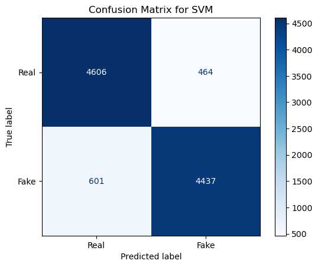
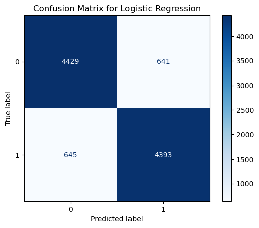
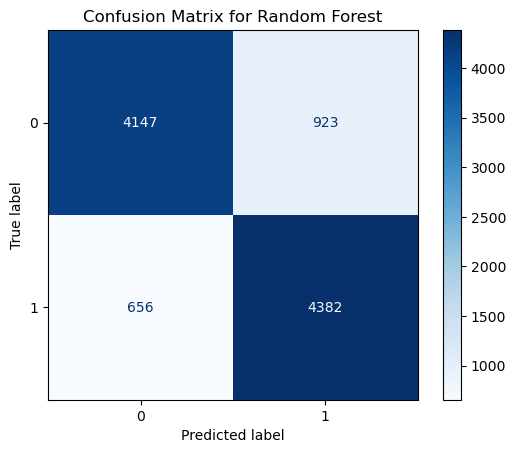

### Fake Review Detection System

**Author**: Andrew Wright

#### Executive Summary
This project aims to develop a machine learning model capable of identifying fake reviews on online platforms. Fake reviews mislead consumers and harm brand credibility, making automated detection an essential tool for maintaining trustworthy online marketplaces.

#### Rationale
Fake reviews negatively impact both consumers and businesses. For consumers, they lead to poor purchasing decisions. For businesses, they can result in lost revenue and damaged reputations. Addressing this issue is crucial for enhancing the quality of online customer experiences.

#### Research Question
How can machine learning be used to accurately identify fake reviews from genuine ones on online platforms?

#### Data Sources
The dataset used for this project contains online reviews labeled as either genuine or fake. The data includes review text along with metadata such as ratings and product categories, which were utilized for analysis and model building.

Data Source: [Fake Reviews Dataset](https://www.kaggle.com/datasets/mexwell/fake-reviews-dataset/data)

#### Methodology
- **Data Exploration and Preprocessing**: Text data was cleaned using the Natural Language Toolkit (NLTK). Steps included converting text to lowercase, removing selected punctuation, tokenization, stopword removal, and lemmatization.
- **Feature Engineering**: TF-IDF was employed to transform textual data into numerical vectors. Sentiment analysis was also used to generate additional features for training.
- **Model Training and Evaluation**: Models including Logistic Regression, Support Vector Machines (SVM), and Random Forest were trained. GridSearchCV was applied for hyperparameter tuning, and models were evaluated using accuracy metrics.

#### Results

##### Confusion Matrix Explained
A confusion matrix visualizes a classification model's performance by showing:
- True Positives (correctly predicted positive cases)
- True Negatives (correctly predicted negative cases)
- False Positives (incorrectly predicted positive)
- False Negatives (incorrectly predicted negative)

##### Legend: 0 = Not Fake, 1 = Fake

The following results were obtained from the best performing models:
- **SVM**: **87.40%** 
    - 
- **Logistic Regression**: **87.18%** 
    - 
- **Random Forest**: **84.40%** 
    - 

#### Next Steps
- Expand the training dataset by incorporating reviews from a broader range of websites to enhance the model's learning capabilities.

- Conduct cross-platform testing to assess the model's ability to accurately detect fake reviews across different online marketplaces.

- Integrate the machine learning model into a live review monitoring system that can automatically identify and flag potentially fraudulent reviews for further investigation.

#### Project Outline
- [Exploring Data Notebook](ExploringData.ipynb)
